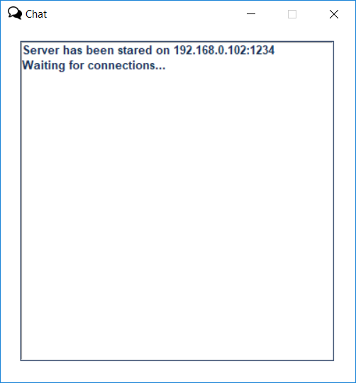
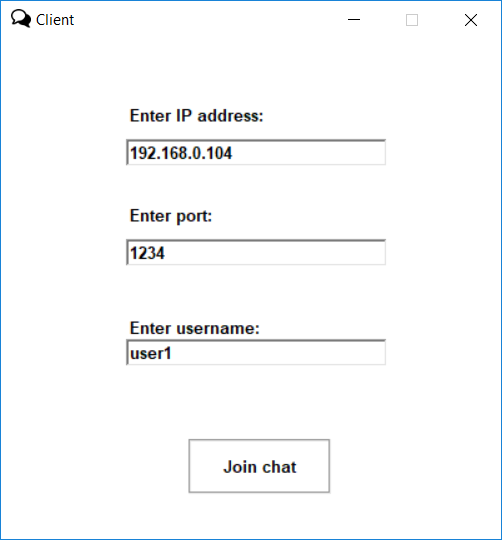
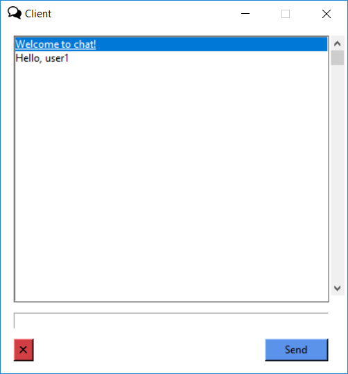

# chat_app
Simple chat application (socket + tkinter)

To start the chat:

1) Run server.py on your computer. You will see following window.

2) Run client.py

3) Enter IP address, port and username as shown below.

4) Now you see welcoming message

5) Run client.py on another PC and try to send message.
